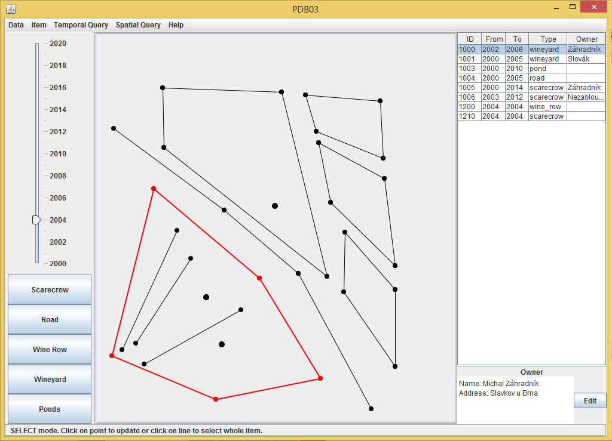
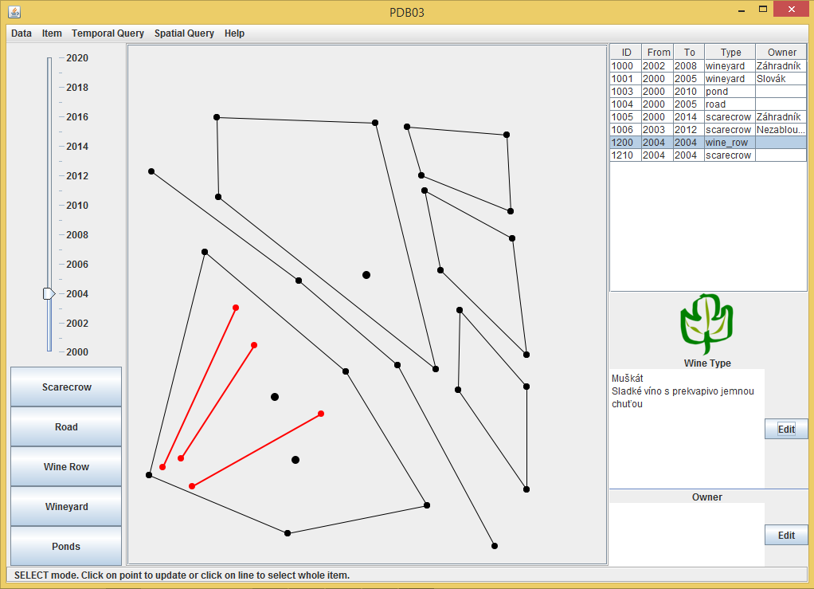

# Managing Wineyards

TODO
<!--
Real-time image filters on video. Like blur, sharpen, median, Canny filter...

Application runs with Python 2, OpenCV 2.4 a NumPy 1.8.

You can download libraries from:
http://www.lfd.uci.edu/~gohlke/pythonlibs/#numpy
    version: numpy-MKL-1.8.1.win32-py2.7.exe

http://www.lfd.uci.edu/~gohlke/pythonlibs/#opencv
    version: opencv-python-2.4.9.win32-py2.7.exe

Projekt byl vytvoren v Eclipse, nejjednodussi spusteni je 
pres otevreni adresare s projektem jako novy projekt v Eclipse.
Pri jinem zpracovani je potreba prilinkovat knihovny v adresari
resources.

Projekt se spousti spustenim tridy Main v baliku pdb03.
    
-->

December 2014

## Authors
* Jan Bednarik - jan.bednarik@hotmail.cz
* Jakub Kvita - kvitajakub@gmail.com
* Peter Lacko - lackopeter17@gmail.com

## Gallery

For more look into directory [_screenshots](_screenshots/).

