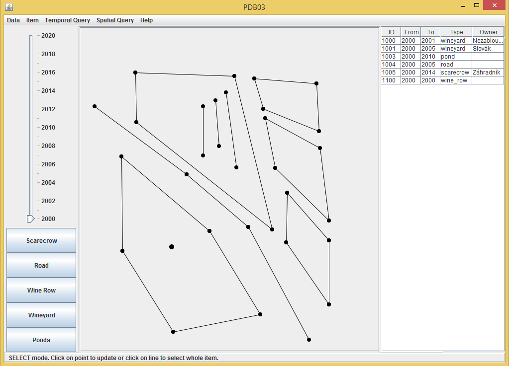

# Managing Wineyards

Application for managing wineyards, connected to Oracle database as backend. Using spatial data 
for map objects as wine rows, ponds and roads, pictures for images of wines, both with extensions 
of Oracle db, with queries created on top of it, including work with temporal data.

It was created as project for course about different types of databases and that is the main goal of this app.

Application is commited as Eclipse project, which is easiest way to open it and run it. Code created needs
libraries included in [resources](resources) directory. Also application is not working without being connected 
to the database, all the time it runs.

December 2014

## Authors
* Jan Bednarik - jan.bednarik@hotmail.cz
* Jakub Kvita - kvitajakub@gmail.com
* Peter Lacko - lackopeter17@gmail.com

## Gallery

For more look into directory [_screenshots](_screenshots/).

